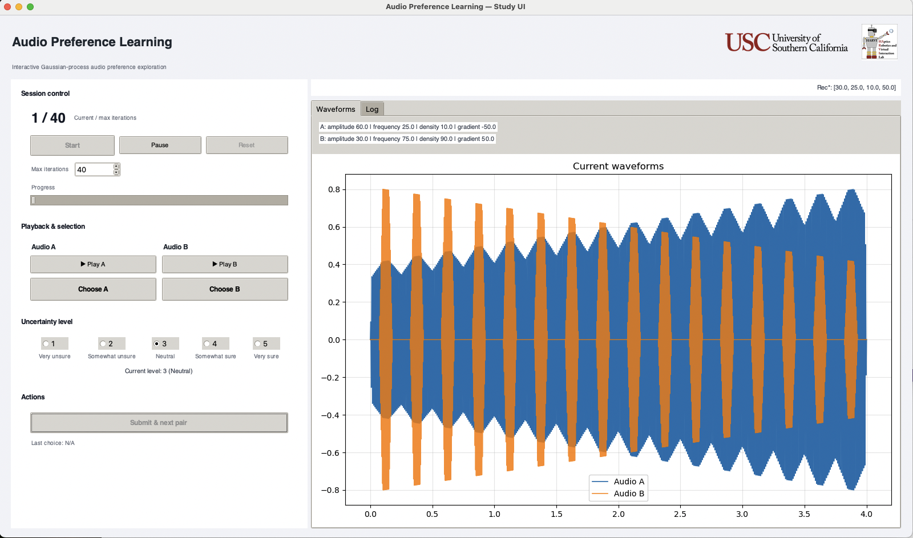

# haptic-preference-learning

[中文版](README_zh-CN.md)

### What is this?

This repo provides a **preference-based haptic personalization** framework that learns a user’s latent utility from **binary A/B choices**. We use a **Gaussian Process (GP) preference model** to capture smoothness and uncertainty over the stimulus space, and an **active query policy** that maximizes **expected information gain** to pick the next comparison. Users can report **response uncertainty**, which is used as per-comparison weights to down-weight ambiguous judgments. By emphasizing **relative** (not absolute) evaluations, the system reduces rating fatigue and drift and avoids forcing tactile sensations onto a numeric scale.

**Highlights**
- GP preference learning over haptic stimuli (uncertainty-aware, smoothness prior)  
- Information-gain active querying for sample-efficient searches  
- Per-comparison **uncertainty weighting** to handle ambiguous answers  
- Open, extensible code for interactive preference search

> _In simulation with synthetic ground truth, the method accurately recovers preference maps and optima, outperforming uniform sampling in sample efficiency._


### What is this?

This repo provides a **preference-based haptic personalization** framework that learns a user’s latent utility from **binary A/B choices**. We use a **Gaussian Process (GP) preference model** to capture smoothness and uncertainty over the stimulus space, and an **active query policy** that maximizes **expected information gain** to pick the next comparison. Users can report **response uncertainty**, which is used as per-comparison weights to down-weight ambiguous judgments. By emphasizing **relative** (not absolute) evaluations, the system reduces rating fatigue and drift and avoids forcing tactile sensations onto a numeric scale.

**Highlights**
- GP preference learning over haptic stimuli (uncertainty-aware, smoothness prior)  
- Information-gain active querying for sample-efficient searches  
- Per-comparison **uncertainty weighting** to handle ambiguous answers  
- Open, extensible code for interactive preference search

> _In simulation with synthetic ground truth, the method accurately recovers preference maps and optima, outperforming uniform sampling in sample efficiency._




## Quick Start
1. Clone the repo:
   ```bash
   git clone https://github.com/iSanshi/haptic-preference-learning.git
   cd haptic-preference-learning
   ```
2. (Optional) create a virtual environment:

3. Install dependencies:
   ```bash
   pip install -r requirements.txt
   ```

4. Launch the UI:
   ```bash
   python run_user_study_ui.py   # manual study workflow
   python run_auto_test_ui.py    # automated testing workflow
   ```

5. Press **Begin** in the UI. In user mode you manually pick A/B clips and rate certainty (1–5); in auto-test mode the system simulates preferences via a ground-truth function.
6. When a session completes, results are exported to `data/YYYYMMDD_<index>/session.json` and `log.txt`.

## Project Layout
```
.
├── requirements.txt
├── README.md
├── README.zh-CN.md
├── run_user_study_ui.py
├── run_auto_test_ui.py
├── tutorial
    ├── gp_interactive_Chinese.html
    └── gp_interactive_English.html
└── src
    └── preference_learning
        ├── __init__.py
        ├── audio
        │   ├── generator.py
        │   └── signal.py
        ├── gp
        │   ├── audio_gp.py
        │   ├── gaussian_process.py
        │   └── math_utils.py
        └── interface
            ├── __init__.py
            ├── session.py
            ├── ui_study.py
            └── logo/
```
