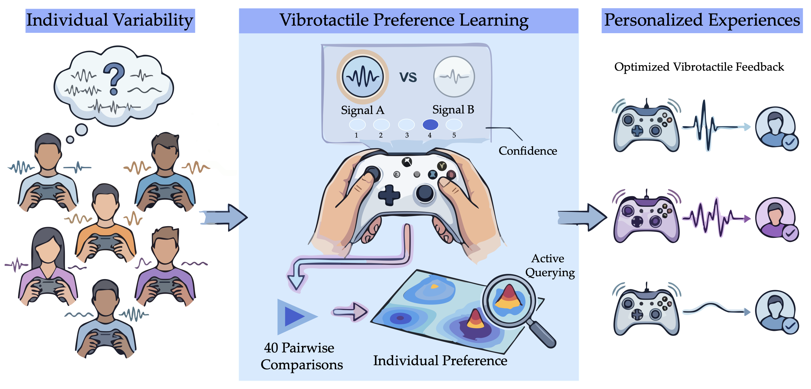
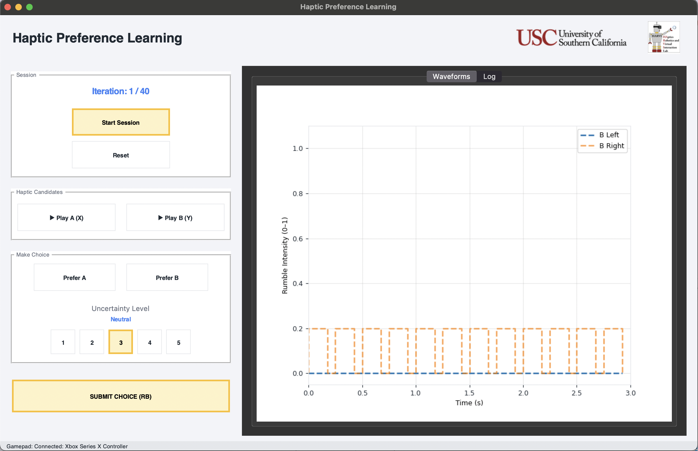
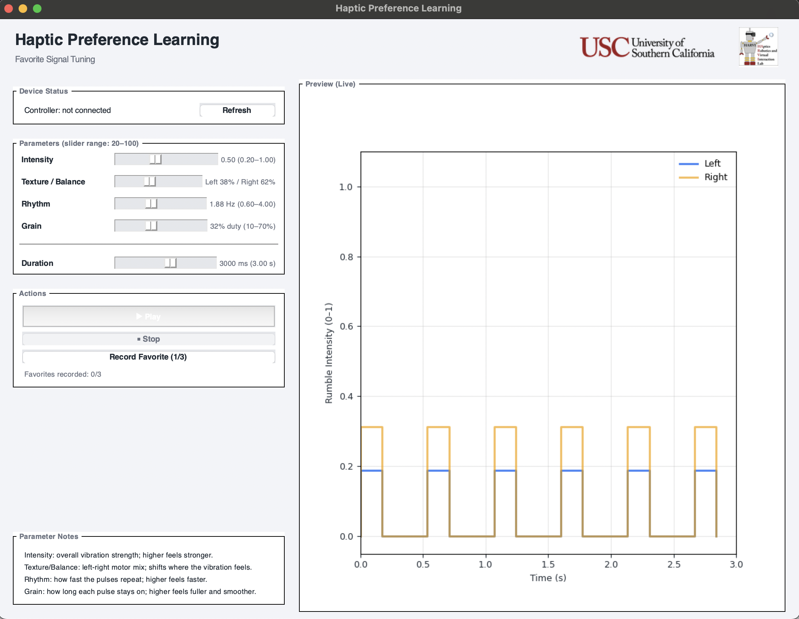

# Vibrotactile Preference Learning

[中文版](README_zh-CN.md)

Official code repository for the ACM UMAP 2026 paper:

**Vibrotactile Preference Learning: Uncertainty-Aware Preference Learning for Personalized Vibration Feedback**

Rongtao Zhang, Xin Zhu, Masoume Pourebadi Khotbehsara, Warren Dao, Erdem Biyik, Heather Culbertson

University of Southern California

This repository contains the implementation of Vibrotactile Preference Learning (VPL), a confidence-aware preference learning framework for personalizing vibrotactile feedback through pairwise comparisons.



## Overview

Vibrotactile Preference Learning (VPL) is an interactive personalization system for vibration feedback. Rather than asking users to assign absolute ratings to haptic stimuli, VPL infers a latent preference model from pairwise A/B comparisons. The system combines Gaussian process preference learning, active query selection based on expected information gain, and user-reported confidence to efficiently search a four-dimensional vibrotactile parameter space under a limited interaction budget.

In the UMAP 2026 paper, we evaluate VPL with vibrotactile feedback generated on a Microsoft Xbox controller. The study shows that the system can learn individualized preferences within 40 pairwise comparisons while keeping interaction effort low.




## Abstract

Individual differences in vibrotactile perception make personalization increasingly important as haptic feedback becomes more prevalent in interactive systems. We propose Vibrotactile Preference Learning (VPL), a system that captures user-specific preference spaces over vibrotactile parameters via Gaussian-process-based uncertainty-aware preference learning. VPL uses an expected-information-gain acquisition strategy to guide query selection over 40 rounds of pairwise comparisons of overall user preference, augmented with user-reported uncertainty, enabling efficient exploration of the parameter space. We evaluate VPL in a user study using vibrotactile feedback from a Microsoft Xbox controller, showing that it efficiently learns individualized preferences while maintaining comfortable, low-workload interaction.

## Repository Contents

- An interactive user-study interface for pairwise vibrotactile preference learning
- An automatic test mode for debugging and simulated evaluation with ground-truth preference functions
- A favorite-signal capture tool for manually recording a user's preferred controller vibration signal
- Gaussian process preference-learning code with information-gain-based query selection
- Session export utilities for logging queries, confidence labels, recommendation summaries, and evaluation metrics

## Method Summary

The implementation follows the workflow described in the paper:

1. Present two candidate vibrotactile signals.
2. Ask the participant which one they prefer.
3. Ask how certain they are about that choice on a 1-5 scale.
4. Update a Gaussian process preference model with confidence-aware weighting.
5. Select the next pair by maximizing expected information gain.
6. After the query budget is exhausted, recommend the signal with the highest posterior mean.

The code uses a four-dimensional parameterization exposed as `intensity`, `texture`, `rhythm`, and `grain`. Legacy aliases such as `amplitude`, `frequency`, `density`, and `gradient` are also supported in parts of the codebase for backward compatibility.

## Repository Structure

```text
.
├── README.md
├── README_zh-CN.md
├── requirements.txt
├── run_study.py
├── run_user_study_ui.py
├── run_auto_test_ui.py
├── xbox_control.py
└── src/
    └── preference_learning/
        ├── audio/
        ├── evaluation.py
        ├── gp/
        └── interface/
```

Key entry points:

- `run_user_study_ui.py`: launch the pairwise preference-learning UI in user-study mode
- `run_auto_test_ui.py`: launch the automatic evaluation UI with a simulated ground-truth preference function
- `run_study.py`: run the user study first, then save one final `favorite_signal.json` in the same session folder
- `xbox_control.py`: standalone favorite-signal tuning and recording tool

## Installation

- Python 3.8 or newer
- Tkinter support in the local Python installation
- PortAudio-compatible audio output for `sounddevice`
- Optional: an Xbox controller for user-study interaction and favorite-signal capture

Install dependencies:

```bash
python -m venv .venv
source .venv/bin/activate  # Windows: .venv\Scripts\activate
pip install -r requirements.txt
```

Python package requirements:

- `matplotlib`
- `numpy`
- `Pillow`
- `pygame`
- `scipy`
- `sounddevice`

## Quick Start

### 1. User study mode

```bash
python run_user_study_ui.py
```

This launches the main VPL interface for human participants. By default, the study uses a 40-query budget.

### 2. Full study pipeline

```bash
python run_study.py
```

This runs the user study first and then opens the favorite-signal recorder. If a session directory was created during Phase 1, the final preferred vibration signal is saved as `favorite_signal.json` inside that same directory.

### 3. Automatic test mode

```bash
python run_auto_test_ui.py
```

Useful options:

```bash
python run_auto_test_ui.py --iters 40 --gt center
python run_auto_test_ui.py --iters 40 --gt bimodal --seed 0
python run_auto_test_ui.py --ranges '{"intensity":[20,100],"texture":[20,100],"rhythm":[20,100],"grain":[20,100]}'
```

Main arguments:

- `--iters`: maximum number of training comparisons
- `--gt`: simulated ground-truth type, one of `center`, `offset`, `bimodal`, or `ridge`
- `--seed`: random seed for reproducible auto tests
- `--ranges`: JSON string or path defining parameter bounds
- `--plot-res`, `--plot-every`, `--plot-min-s`: visualization controls for automatic testing

### 4. Standalone favorite-signal capture

```bash
python xbox_control.py
```

## Controller Interaction

In the user-study UI:

- D-pad or left stick: move focus
- `X`: activate the focused button
- `A`: play candidate A
- `B`: play candidate B
- `Start`: start the session when available

## Output Files

### User study output

Each completed study session is saved under:

```text
data/YYYYMMDD_<index>/
```

Typical files:

- `session.json`: structured record of the study session
- `log.txt`: plain-text session log
- `favorite_signal.json`: final preferred signal recorded after `run_study.py`

### Standalone favorite tuning output

By default, `xbox_control.py` writes files under:

```text
data/bestparam/
```

If `--single-file` or `--output-dir` is used, output behavior changes accordingly.

## `session.json` Contents

The exported session file includes both legacy fields and structured summaries. Important sections include:

- `final_summary`: final recommendation, optimization method, posterior uncertainty, and evaluation summaries
- `metrics`: per-iteration histories such as `info_gain` and `posterior_best_mean`
- `metadata`: session mode, planned queries, completed queries, and completion status
- Validation and test fields such as `gt_best_val`, `gt_best_params`, `gt_regret_history`, and `gt_spearman_history`

Example:

```json
{
  "final_summary": {
    "recommended_params": [61.2, 58.7, 64.0, 55.9],
    "recommended_score": 0.84,
    "method": "lbfgsb"
  },
  "metrics": {
    "info_gain": [0.21, 0.19, 0.17],
    "posterior_best_mean": [0.41, 0.53, 0.61]
  },
  "metadata": {
    "mode": "User Study",
    "n_queries_planned": 40,
    "n_queries_completed": 40,
    "status": "complete"
  }
}
```

## Reproducing the Paper Workflow

To reproduce the workflow described in the paper:

1. Install dependencies and confirm local audio output works.
2. Connect an Xbox controller if you plan to run the human-participant workflow.
3. Run `python run_user_study_ui.py` for the main 40-comparison preference-learning session.
4. Run `python run_study.py` if you also want to collect the participant's final favorite vibration signal after the study.
5. Run `python run_auto_test_ui.py` to debug or benchmark the learning pipeline against simulated preference functions before or alongside user testing.

## Citation

If you use this code in academic work, please cite the paper:

```bibtex
@inproceedings{zhang2026vpl,
  title = {Vibrotactile Preference Learning: Uncertainty-Aware Preference Learning for Personalized Vibration Feedback},
  author = {Zhang, Rongtao and Zhu, Xin and Pourebadi Khotbehsara, Masoume and Dao, Warren and Biyik, Erdem and Culbertson, Heather},
  booktitle = {Proceedings of the 34th ACM Conference on User Modeling, Adaptation and Personalization (UMAP '26)},
  year = {2026},
  address = {Gothenburg, Sweden}
}
```

## License

This repository is released under the [Creative Commons Attribution 4.0 International License](https://creativecommons.org/licenses/by/4.0/).
