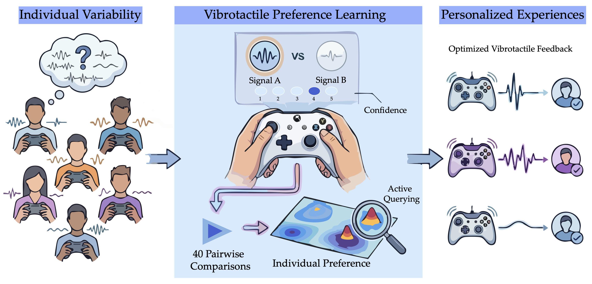

# Vibrotactile Preference Learning

[English README](README.md)

本仓库为 ACM UMAP 2026 论文的官方代码仓库：

**Vibrotactile Preference Learning: Uncertainty-Aware Preference Learning for Personalized Vibration Feedback**

作者：Rongtao Zhang, Xin Zhu, Masoume Pourebadi Khotbehsara, Warren Dao, Erdem Biyik, Heather Culbertson

单位：University of Southern California

本仓库提供 Vibrotactile Preference Learning（VPL）的完整实现。VPL 是一个面向振动反馈个性化的、结合用户不确定度信息的偏好学习框架，通过成对比较来学习用户的振动偏好。



## 项目概述

Vibrotactile Preference Learning（VPL）是一个面向振动反馈个性化的交互式学习系统。与传统的绝对打分方式不同，VPL 通过用户对两组候选振动信号的 A/B 偏好比较来推断其潜在偏好模型。系统将高斯过程偏好学习、基于期望信息增益的主动查询策略，以及用户自报的不确定度结合起来，在有限交互预算内高效搜索四维振动参数空间。

在 UMAP 2026 论文中，我们基于 Microsoft Xbox 控制器的振动反馈对 VPL 进行了用户研究。结果表明，该系统能够在 40 轮成对比较内学习到个体化偏好，同时保持较低的交互负担。


## 摘要

随着触觉反馈在交互系统中的广泛应用，个体间在振动触觉感知上的差异使个性化变得尤为重要。我们提出 Vibrotactile Preference Learning（VPL），一种基于高斯过程、结合不确定度建模的振动偏好学习系统，用于刻画用户在振动参数空间中的个体化偏好。VPL 基于期望信息增益选择查询，在 40 轮成对比较中高效探索参数空间，并结合用户自报的不确定度来增强学习过程。我们基于 Microsoft Xbox 控制器的振动反馈开展了用户研究，结果表明 VPL 能够有效学习个体偏好，同时保持较低的交互负担和较好的用户体验。

## 仓库内容

- 面向真实参与者的成对偏好学习用户实验界面
- 用于调试和模拟评估的自动测试模式
- 用于记录用户最终最喜欢振动信号的收藏信号采集工具
- 基于高斯过程的偏好学习与信息增益查询选择实现
- 用于导出查询历史、置信度标签、推荐结果和评估指标的会话记录模块

## 方法概述

代码实现遵循论文中的核心流程：

1. 呈现两组候选振动信号。
2. 询问参与者更偏好哪一个。
3. 让参与者用 1-5 级报告该判断的确定程度。
4. 使用带置信度权重的高斯过程偏好模型更新后验。
5. 通过最大化期望信息增益选择下一组比较。
6. 在预算耗尽后，输出后验均值最高的推荐信号。

代码中使用四维参数表示，当前主命名为 `intensity`、`texture`、`rhythm`、`grain`。为兼容历史版本，部分模块也保留了 `amplitude`、`frequency`、`density`、`gradient` 等旧参数名。

## 仓库结构

```text
.
├── README.md
├── README_zh-CN.md
├── requirements.txt
├── run_study.py
├── run_user_study_ui.py
├── run_auto_test_ui.py
├── xbox_control.py
└── src/
    └── preference_learning/
        ├── audio/
        ├── evaluation.py
        ├── gp/
        └── interface/
```

主要入口：

- `run_user_study_ui.py`：启动用户实验模式下的成对偏好学习界面
- `run_auto_test_ui.py`：启动自动测试界面，使用模拟地面真值偏好函数进行验证
- `run_study.py`：先运行用户实验，再把最终收藏的振动信号保存为同一会话目录下的 `favorite_signal.json`
- `xbox_control.py`：独立的收藏振动信号调节与记录工具

## 安装

### 环境要求

- Python 3.8 及以上
- 本地 Python 需包含 Tkinter
- `sounddevice` 可用的 PortAudio 音频输出环境
- 可选：Xbox 控制器，用于用户实验和收藏信号记录

安装依赖：

```bash
python -m venv .venv
source .venv/bin/activate  # Windows: .venv\Scripts\activate
pip install -r requirements.txt
```

依赖包包括：

- `matplotlib`
- `numpy`
- `Pillow`
- `pygame`
- `scipy`
- `sounddevice`

## 快速开始

### 1. 用户实验模式

```bash
python run_user_study_ui.py
```

该入口会启动主实验界面。默认使用 40 轮查询预算。

### 2. 完整实验流程

```bash
python run_study.py
```

该脚本会先运行偏好学习实验，再进入收藏信号记录阶段。如果第一阶段成功创建了会话目录，最终最喜欢的振动信号会保存为该目录下的 `favorite_signal.json`。

### 3. 自动测试模式

```bash
python run_auto_test_ui.py
```

常用示例：

```bash
python run_auto_test_ui.py --iters 40 --gt center
python run_auto_test_ui.py --iters 40 --gt bimodal --seed 0
python run_auto_test_ui.py --ranges '{"intensity":[20,100],"texture":[20,100],"rhythm":[20,100],"grain":[20,100]}'
```

主要参数：

- `--iters`：训练阶段的最大比较轮数
- `--gt`：模拟地面真值类型，可选 `center`、`offset`、`bimodal`、`ridge`
- `--seed`：自动测试随机种子，便于复现
- `--ranges`：参数边界，支持 JSON 字符串或 JSON 文件路径
- `--plot-res`、`--plot-every`、`--plot-min-s`：自动测试可视化控制参数

### 4. 独立收藏信号记录

```bash
python xbox_control.py
```

## 手柄操作

用户实验界面中的默认操作方式如下：

- 方向键或左摇杆：移动焦点
- `X`：激活当前焦点按钮
- `A`：播放候选 A
- `B`：播放候选 B
- `Start`：在可用时启动实验

## 输出文件

### 用户实验输出

每次完成的实验会话默认保存在：

```text
data/YYYYMMDD_<index>/
```

常见输出文件：

- `session.json`：结构化实验记录
- `log.txt`：纯文本日志
- `favorite_signal.json`：通过 `run_study.py` 记录的最终收藏信号

### 独立收藏模式输出

`xbox_control.py` 默认输出到：

```text
data/bestparam/
```

如果使用 `--single-file` 或 `--output-dir`，输出行为会相应变化。

## `session.json` 内容

导出的会话文件兼容历史字段，并新增结构化摘要。重点字段包括：

- `final_summary`：最终推荐参数、优化方法、后验不确定性和评估摘要
- `metrics`：按轮次记录的历史指标，例如 `info_gain`、`posterior_best_mean`
- `metadata`：会话模式、计划查询数、实际完成数和完成状态
- 验证与测试相关字段，例如 `gt_best_val`、`gt_best_params`、`gt_regret_history`、`gt_spearman_history`

示例：

```json
{
  "final_summary": {
    "recommended_params": [61.2, 58.7, 64.0, 55.9],
    "recommended_score": 0.84,
    "method": "lbfgsb"
  },
  "metrics": {
    "info_gain": [0.21, 0.19, 0.17],
    "posterior_best_mean": [0.41, 0.53, 0.61]
  },
  "metadata": {
    "mode": "User Study",
    "n_queries_planned": 40,
    "n_queries_completed": 40,
    "status": "complete"
  }
}
```

## 复现论文流程

如需复现论文中的主要流程，可按以下顺序进行：

1. 安装依赖并确认本地音频输出正常。
2. 如果需要进行真人实验，连接 Xbox 控制器。
3. 运行 `python run_user_study_ui.py`，执行 40 轮主偏好学习过程。
4. 如果还需要记录参与者最终最喜欢的振动信号，运行 `python run_study.py`。
5. 在正式实验前或并行评估时，可运行 `python run_auto_test_ui.py` 对学习流程进行模拟验证和调试。

## 引用

如果本仓库对你的研究有帮助，请引用论文：

```bibtex
@inproceedings{zhang2026vpl,
  title = {Vibrotactile Preference Learning: Uncertainty-Aware Preference Learning for Personalized Vibration Feedback},
  author = {Zhang, Rongtao and Zhu, Xin and Pourebadi Khotbehsara, Masoume and Dao, Warren and Biyik, Erdem and Culbertson, Heather},
  booktitle = {Proceedings of the 34th ACM Conference on User Modeling, Adaptation and Personalization (UMAP '26)},
  year = {2026},
  address = {Gothenburg, Sweden}
}
```

## 许可证

本仓库采用 [Creative Commons Attribution 4.0 International License](https://creativecommons.org/licenses/by/4.0/) 进行许可。
